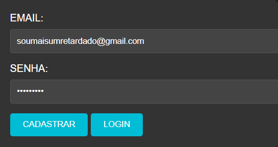

# CADASTRO E LOGIN COM NODEJS E MONGODB
👨‍🏫FORMULARIO DE CADASTRO E LOGIN EM HTML, CSS, JS (NODEJS) E MONGODB.

 <br> 

## DESCRIÇÃO:
Este aplicativo é um sistema de registro e autenticação de usuários que utiliza um banco de dados MongoDB para armazenar informações dos clientes. Aqui está uma descrição detalhada das funcionalidades:

1. **Cadastro de Usuários:**
   - Os usuários podem se cadastrar fornecendo um endereço de e-mail e uma senha.
   - Quando um usuário se cadastra, a senha é criptografada usando o algoritmo bcrypt para garantir a segurança das informações no banco de dados.
   - As informações de e-mail e senha criptografada são armazenadas no MongoDB.

2. **Autenticação de Usuários:**
   - Os usuários cadastrados podem fazer login fornecendo seu endereço de e-mail e senha.
   - O sistema verifica se o e-mail está registrado no banco de dados.
   - Se o e-mail for encontrado, a senha fornecida é comparada com a senha armazenada no banco de dados, utilizando o bcrypt para descriptografar e verificar a correspondência.
   - Se a senha estiver correta, o usuário é autenticado com sucesso.

3. **Mensagens de Feedback:**
   - O aplicativo fornece mensagens de feedback para informar os usuários sobre o resultado das operações de cadastro e login.
   - Se ocorrerem erros durante o cadastro ou login, mensagens apropriadas são exibidas para orientar o usuário.

4. **Execução do Servidor:**
   - O servidor Express é configurado para escutar as requisições na porta 3000.
   - Quando o servidor está em execução, ele pode processar solicitações de cadastro e login enviadas pelo cliente.

## COMO USAR?
### BAIXANDO O PROJETO:
* Clone o repositório para o seu sistema local:

```bash
git clone https://github.com/VILHALVA/CADASTRO-E-LOGIN-COM-NODEJS-E-MONGODB.git
```

* Navegue até o diretório do projeto.

```bash
cd CADASTRO-E-LOGIN-COM-NODEJS-E-MONGODB
```

* Descompacte o arquivo ZIP (se você baixou manualmente):

```bash
unzip CADASTRO-E-LOGIN-COM-NODEJS-E-MONGODB.zip
```

### EXECUTANDO O PROJETO:
1. **Inicie o Servidor MongoDB:**
   - Abra um terminal ou prompt de comando.
   - Navegue até o diretório onde o MongoDB está instalado (geralmente, o diretório padrão é algo como `C:\Program Files\MongoDB\Server\{versão}\bin` no Windows ou `/usr/local/bin` no macOS/Linux).
   - Execute o comando para iniciar o servidor MongoDB:
     ```
     mongod
     ```
   - Isso iniciará o servidor MongoDB e ele estará pronto para aceitar conexões do aplicativo.

Não é necessário criar explicitamente um banco de dados no MongoDB antes de usá-lo. Ele é um banco de dados NoSQL orientado a documentos e cria bancos de dados e coleções automaticamente conforme você insere dados.

Certifique-se de que o servidor MongoDB esteja em execução sempre que você quiser interagir com o aplicativo, pois o aplicativo precisa se conectar ao servidor MongoDB para armazenar e recuperar dados dos clientes.

2. **Configuração do JS:**

   - Abra o arquivo `./CODIGO/CODIGO.js` e ajuste as configurações da sua conexão `mongoose.connect` na linha 12:

     ```javascript
     mongoose.connect('mongodb://localhost:27017/registro', //...
     ```

   - OU:
   ```javascript
     mongoose.connect('mongodb://127.0.0.1:27017/registro', //...
     ```

   - OU:
   ```javascript
     mongoose.connect('mongodb://<--SEU IP DE CONEXÃO-->:27017/registro', //...
     ```

3. **Instalando as Depêndencias:**

   - Para instalar as dependências listadas no arquivo "package.json", você pode usar o comando `npm install` ou simplesmente `npm i` no terminal. Certifique-se de estar no diretório do seu projeto onde o arquivo "package.json" está localizado. O npm irá ler o arquivo "package.json" e instalar todas as dependências listadas nele. 

   - Aqui está o comando:

   ```bash
   npm install mongoose
   ```

   ```bash
   npm install
   ```

   ou

   ```bash
   npm i
   ```

4. **Executando o Aplicativo:**

   - Para subir o servidor, no diretório do seu [projeto](./CODIGO/CODIGO.js), digite o seguinte comando no Terminal/CMD:
   ```bash
   node CODIGO.js
   ```
   - OU:
   ```bash
   nodemon CODIGO.js
   ```

   - Acesse o APP no navegador visitando `http://localhost:3000`.

## NÃO SABE?
- Entendemos que para manipular arquivos em `HTML`, `CSS` e outras linguagens relacionadas, é necessário possuir conhecimento nessas áreas. Para auxiliar nesse aprendizado, oferecemos cursos gratuitos disponíveis:
* [CURSO DE HTML E CSS](https://github.com/VILHALVA/CURSO-DE-HTML-E-CSS)
* [CURSO DE NODEJS](https://github.com/VILHALVA/CURSO-DE-NODEJS)
* [CURSO DE MONGODB](https://github.com/VILHALVA/CURSO-DE-MONGODB)
* [CONFIRA MAIS CURSOS](https://github.com/VILHALVA?tab=repositories&q=+topic:CURSO)

## CREDITOS:
- [PROJETO CRIADO PELO VILHALVA](https://github.com/VILHALVA)


